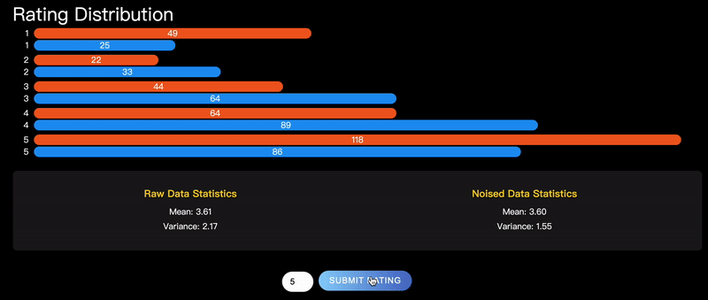
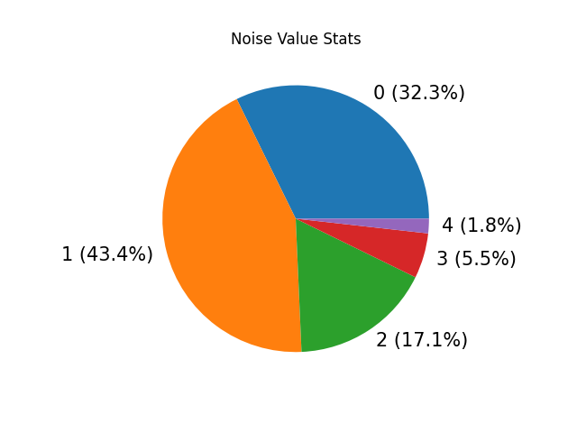
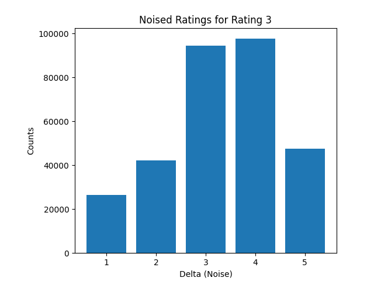
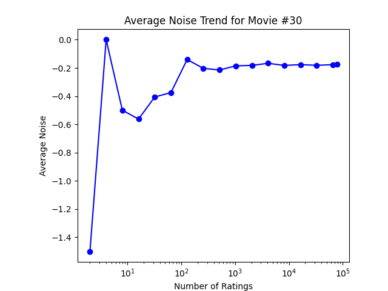
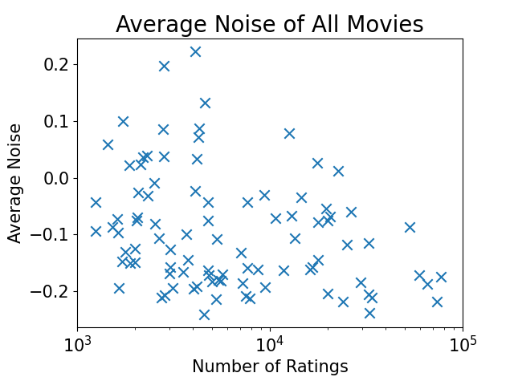
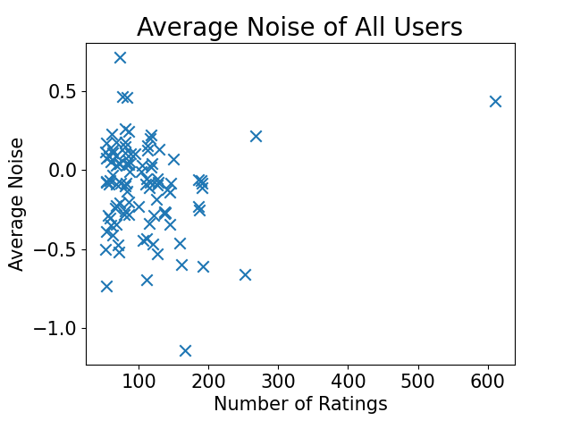
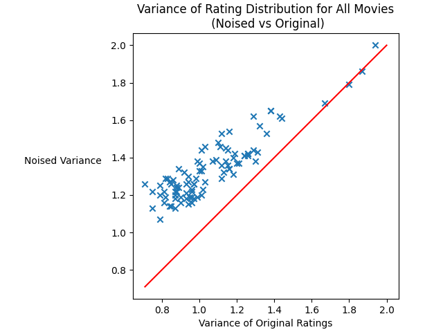

# Introduction

> Report: [**PrivyPlot**: Differential Privacy on Movie Ratings](./results/final_report.pdf)



# Installation

## Activate venv

```shell
virtualenv -p python3 venv
source venv/bin/activate
```

## Install Dependencies

To install packages
```shell
pip3 install -r requirements.txt 
```

To export packages
```shell
pip3 freeze > requirements.txt
```

## MySQL Database

Reference: https://docs.djangoproject.com/en/4.2/ref/databases/#mysql-notes

Install MySQL firstly and run it locally.

Install mysqlclient on MacOS: see https://github.com/PyMySQL/mysqlclient
```shell
# Assume you are activating Python 3 venv
brew install mysql-client pkg-config
export PKG_CONFIG_PATH="$(brew --prefix)/opt/mysql-client/lib/pkgconfig"
pip install mysqlclient
```

Modify the database setting in `rating_backend/settings.py`:

```python
DATABASES = {
    'default': {
        'ENGINE': "django.db.backends.mysql",
        "NAME": "movie",
        "USER": "root",
        "PASSWORD": "password",
        "HOST": "127.0.0.1",
        "PORT": 3306,
    }
}
```


# Prepare Netflix Rating Dataset

Download the data from
https://www.kaggle.com/datasets/rishitjavia/netflix-movie-rating-dataset/data, and put them under `./archive`.

Run the following command to sort the dataset:

```
python movie/data_sort.py
python movie/data_sort2.py
```


# Run the project

```shell
 # start the database
 mysql.server start 

 # start the backend service
 # the backend endpoints will be available at http://127.0.0.1:8000/
 python manage.py runserver 

 # start the frontend service
 # the frontend webpage will open at http://localhost:3000/
 cd rating_frontend
 npm start
```


# API List v1

- GET /v1/movie/load
  
  Load Data     

  Load data from csv files under folder `./archive`. 
  
  Because there're too many ratings in the dataset, by default we only load at most 1000 ratings for each movie. To change this, comment out the following code in function `load_csv_data` in `./movie/movie.py`:
  
  ```python
          if movie_rate_user_count >= 1000:
              continue
  ```
  
- GET /v1/movie/evaluate/mid/\<int:max_movie_id\>/
  
  Evaluate the Netflix Dataset by movies: load the ratings for movies whose movie_id < max_movie_id, add noise to them and export evaluation results under ./`results` folder. By default we only load at most 1000 ratings for each movie.

- GET /v1/movie/evaluate/uid/\<int:max_user_id\>/

  Evaluate the Netflix Dataset by users: load the ratings for users whose user_id < max_user_id, add noise to them and export evaluation results under `./results` folder. 

- POST /v1/movie/\<int:movie_id\>/rate/
  
  **Parameters needed in the Body of request: user_id (int), rating (int)**

  Store a user's rating for a movie, and add noise for it.
  
- GET /v1/movie/\<int:id\>
  
  Get all the info about a movie.

- GET /v1/movie/get_rating_distribution/\<int:movie_id\>/
  
  Get distribution of ratings for a specific movie.

- GET /v1/user/rating
  
  Get ratings of a user.

  ------------ Attention: The following APIs stores charts generated under `./movie/diagrams` folder. ---------
  
- GET /v1/movie/generate_noise_pie_diagram/

  GET /v1/movie/generate_noise_pie_diagram/\<int:movie_id\>/

  Generate and return the noise pie chart for all noised ratings or noised ratings of a movie. 

  We also draw the bar chart of noise value distribution for each original rating value, but does not return them in response.

  Example:

  

  

  

- GET /v1/movie/generate_noise_trend_diagram/\<int:movie_id\>/

  Generate and return the trend of average noise for a movie with movie_id.

  Example:




------------ Attention: The following APIs depends on the csv files under `./results` folder. --------------

------------ Make sure to run `/v1/movie/evaluate/` firstly. --------------


- GET /v1/movie/generate_avg_noises_diagram_all_movies/

  Generate and return the average noise scatter chart for all movies according to latest result file under `./results` folder.

  Example:

  

- GET /v1/movie/generate_avg_noises_diagram_all_users/

  Generate and return the average noise scatter chart for all users according to latest result file under `./results` folder.

  Example:



- GET /v1/movie/generate_variance_diagram_all_movies/

  Generate and return the scatter chart showing the variance of ratings for all movies according to latest result file under `./results` folder. Draw function $y=x$ as a baseline for comparison.

  Example:

  


# References

[The Exponential Mechanism](https://programming-dp.com/ch9.html)


